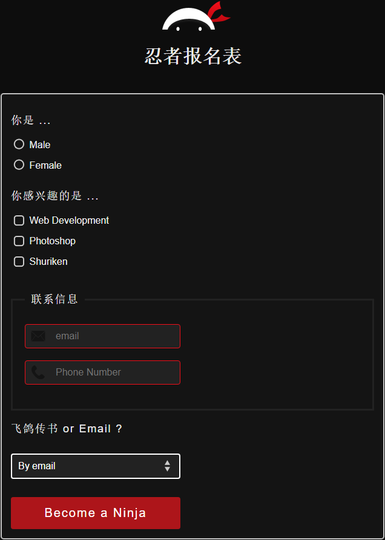
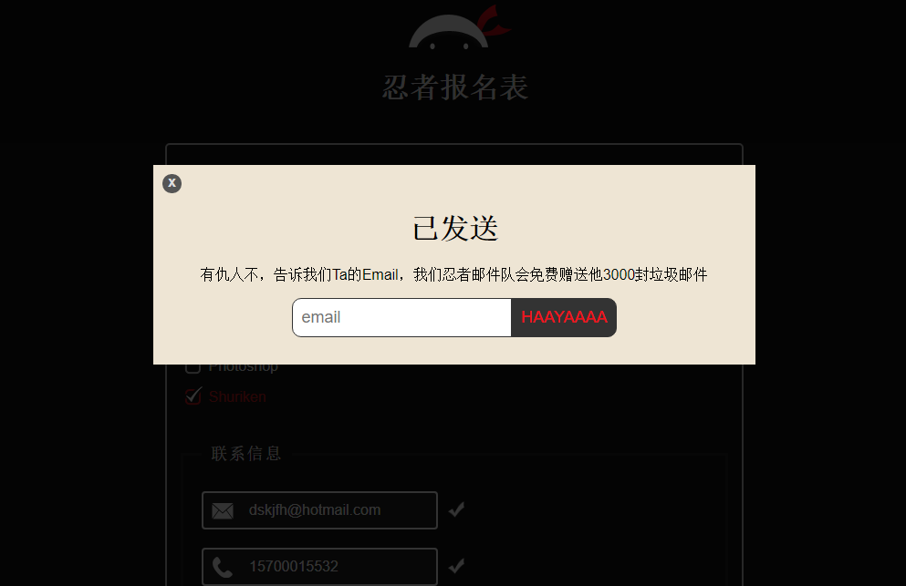

# Ninja-form(忍者报名表)

此项目用了一些CSS来装饰的html表格。主题：忍者。使用的是黑色背景和白色字体和一些Javascript用在了提交后的‘已发送’页面和画面。

### About

The objective of this project was to decorate a basic html form with some CSS and javascript. The theme i had in mind was a ninja theme using a dark background and white fonts.

### Aim
<ul>
  <li>add simple validation checks for the both email input and telephone input </li>
  <li>put an eventlistener on keystrokes instead of a submit button </li>
</ul>

### Tools used
<ul>
  <li>Html</li>
  <li>CSS</li>
  <li>Javascript</li>
</ul>

### How to run
To run this project simply go to my Github repository and download all the files, click on index.html to get started!

### Project URL
This project is currently hosted at: 
https://snaxbox.github.io/ninja-form/
